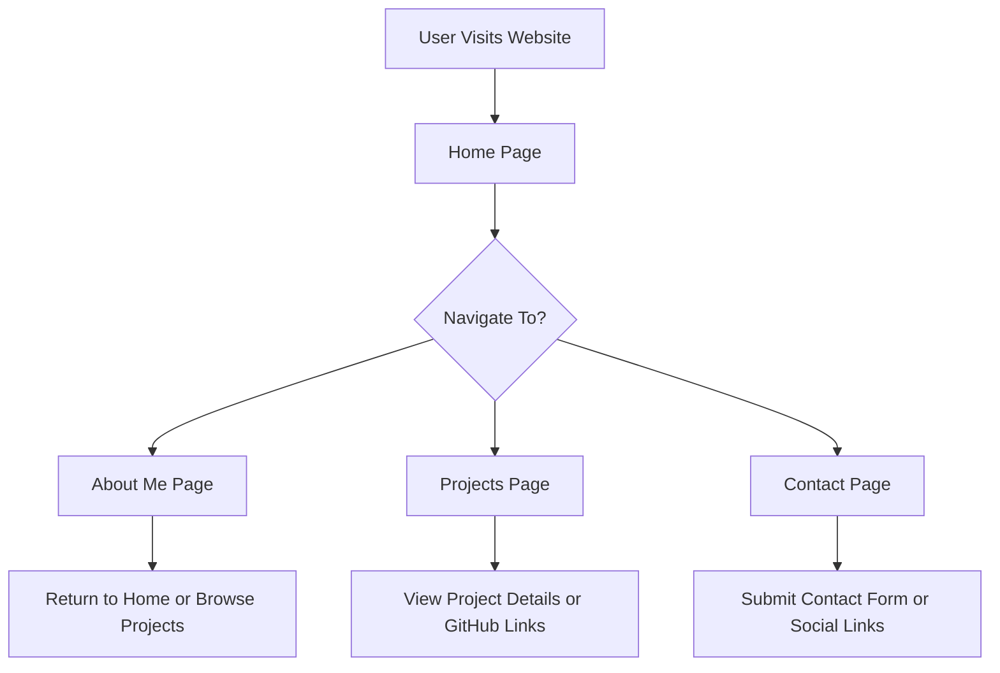

# 🧑‍💻 Personal Portfolio Website – Developer Documentation

## 🎯 Project Overview

This project is a **Personal Portfolio Website** designed to showcase a web developer's:

- **Skills**
- **Projects**
- **Professional Background**
- **Contact Details**

The portfolio acts as a **digital resume** and a platform for personal branding. It features a modern, responsive, and visually appealing UI, built using only **HTML, CSS, and JavaScript**.

---

## ⚙️ Tech Stack

- **HTML**: Markup structure
- **CSS**: Styling, layout, and animations
- **JavaScript**: Interactivity and dynamic elements (e.g., project modals, scroll effects)
- **Optional Libraries**:
  - [Font Awesome](https://fontawesome.com/) (icons)
  - [Google Fonts](https://fonts.google.com/) (typography)

---

## 🗂️ Folder Structure

```
portfolio-website/
│
├── index.html         # Home page
├── about.html         # About Me page
├── projects.html      # Projects page
├── contact.html       # Contact form/page
│
├── css/
│   └── style.css      # Custom styling
│
├── js/
│   └── script.js      # JavaScript for interactivity
│
├── assets/
│   ├── images/        # Profile & project images
│   └── resume.pdf     # Downloadable resume
```

---

## 🔄 Application Flow



---

## 📄 Page Descriptions

- **Home Page (`index.html`)**: Brief introduction, hero section, and navigation.
- **About Me (`about.html`)**: Developer's background, skills, and experience.
- **Projects (`projects.html`)**: Gallery of projects with details and links.
- **Contact (`contact.html`)**: Contact form and social media links.

---

## 🚀 Features

- **Responsive Design**: Optimized for all devices.
- **Smooth Navigation**: Intuitive and accessible menu.
- **Interactive Elements**: Project modals, scroll animations, and more.
- **Downloadable Resume**: Easy access to a PDF resume.
- **Accessible**: Follows best practices for accessibility.

---

## 🛠️ Customization

- Update images in `assets/images/`.
- Replace `resume.pdf` with your own.
- Edit content in HTML files as needed.
- Modify styles in `css/style.css` for branding.

---

## 📬 Contact

For questions or contributions, please reach out via the contact form or connect on social media.

---
